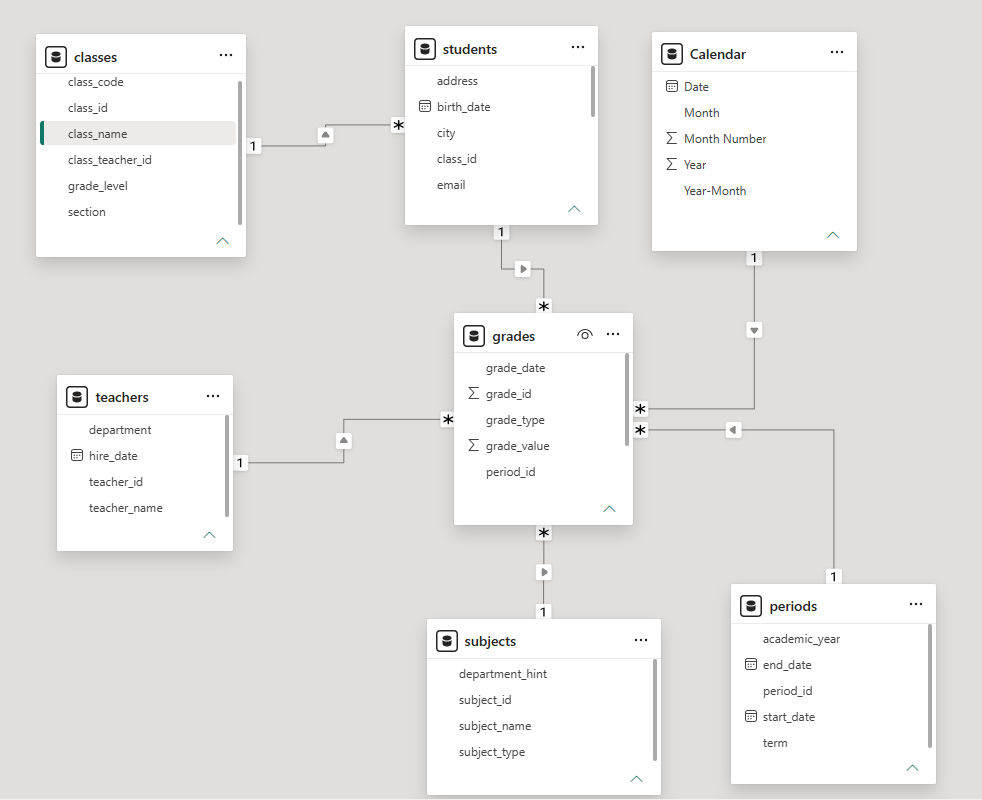
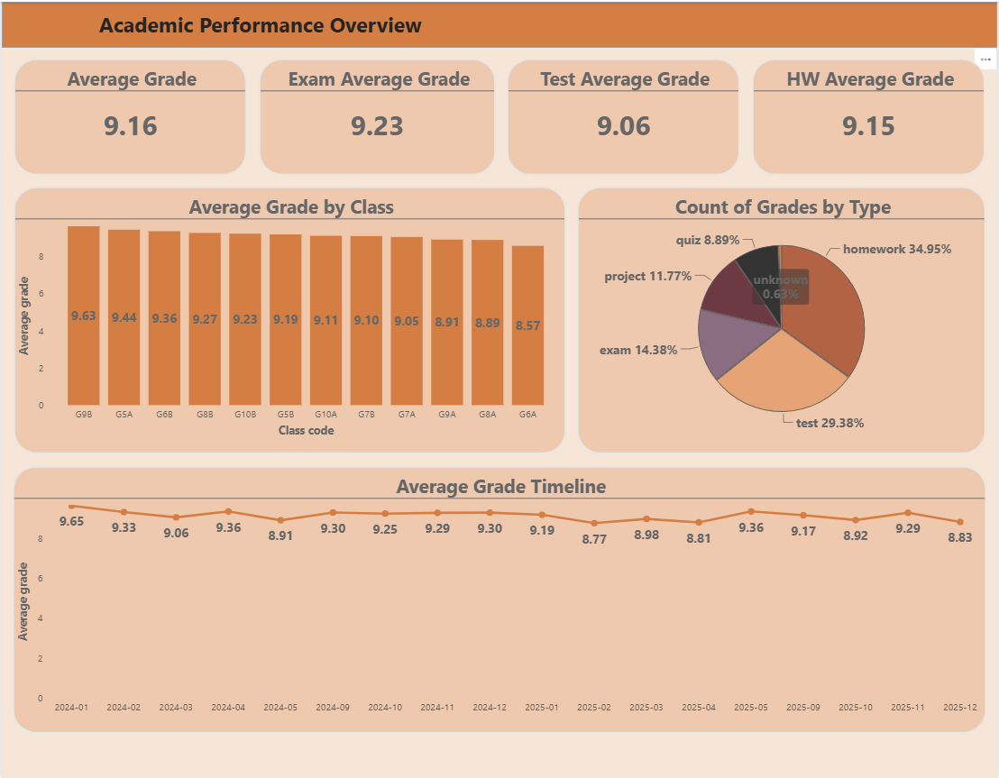
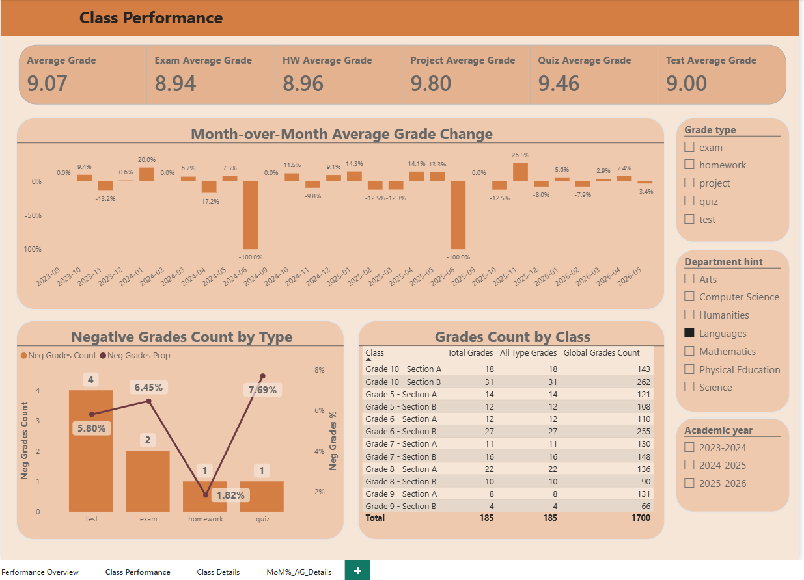
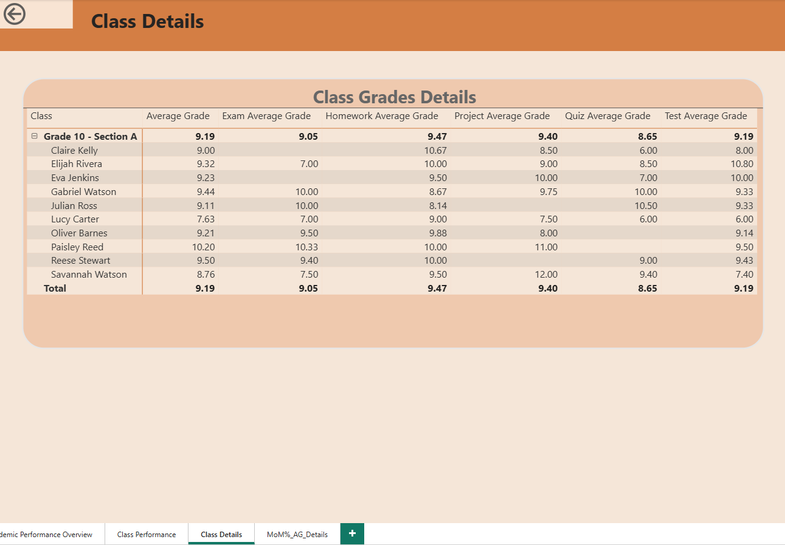
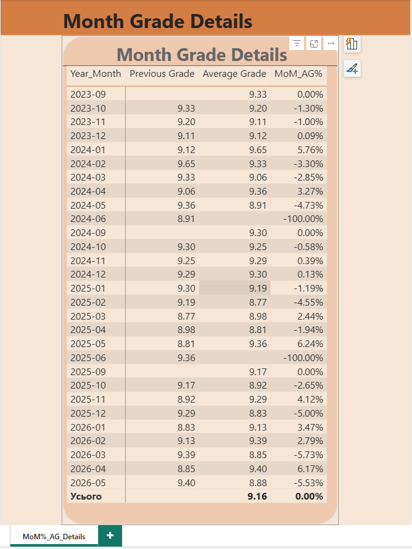
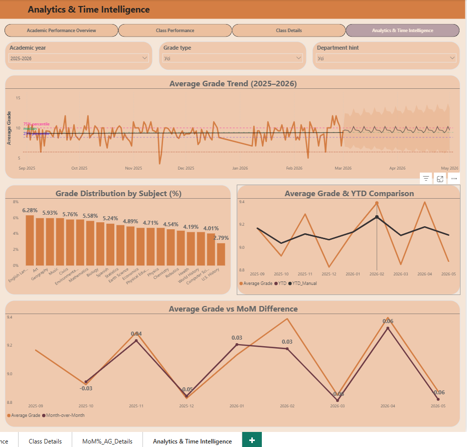

# 🎓 Academic Performance Dashboard | Power BI

## 📌 Project Overview

This project presents an interactive **Academic Performance Dashboard** built in **Power BI**.  
The dashboard analyzes student grades across classes, subjects, teachers, grade types, departments, and academic periods.

The main goal of the project is to transform raw school performance data into a clean analytical model and build a multi-page Power BI report with KPI cards, class-level analysis, student-level drill-through, tooltip details, and time intelligence analytics.

---

## 🎯 Project Objectives

- Clean and transform educational data in Power Query
- Build a correct analytical data model using Star Schema principles
- Create a DAX calendar table for time-based analysis
- Develop reusable DAX measures for academic performance tracking
- Analyze average grades by class, grade type, subject, and month
- Identify negative grades and their share by assessment type
- Add drill-through and tooltip pages for detailed analysis
- Implement time intelligence calculations, YTD comparison, MoM change, trends, percentiles, and forecasting
- Design a consistent multi-page Power BI dashboard

---

## 🗂️ Dataset Description

The project uses several CSV tables that represent a school academic system:

| Table | Description |
|---|---|
| `grades.csv` | Fact table with grade records, grade values, grade dates, grade types, and foreign keys |
| `students.csv` | Student dimension with names, gender, birth dates, class IDs, enrollment data, city, and email |
| `classes.csv` | Class dimension with class code, grade level, section, class name, and class teacher |
| `teachers.csv` | Teacher dimension with teacher name, hire date, and department |
| `subjects.csv` | Subject dimension with subject name, type, and department hint |
| `periods.csv` | Academic period dimension with academic year, term, start date, and end date |
| `Calendar` | DAX-generated date table used for time intelligence |

---

## 🧱 Data Model

The model was designed as a **Star Schema**, where `grades` is the central fact table and all descriptive tables are dimensions.

Main relationships:

- `students[student_id]` → `grades[student_id]`
- `classes[class_id]` → `students[class_id]`
- `teachers[teacher_id]` → `grades[teacher_id]`
- `subjects[subject_id]` → `grades[subject_id]`
- `periods[period_id]` → `grades[period_id]`
- `Calendar[Date]` → `grades[grade_date]`

All key analytical relationships use **one-to-many** logic with controlled single-direction filtering.



---

## 🧹 Data Preparation

Data cleaning and transformation were completed in **Power Query**:

- Correct data types were assigned to all columns
- Date fields were converted using the `en-US` locale
- `grade_value` was converted from text to numeric format
- Missing and incorrect values were checked and handled
- Primary and foreign keys were checked for blanks and duplicates
- Blank grade types were handled for correct visual filtering

---

## 📊 Metrics

The report uses a separate `_Measures` table to store all DAX measures.

Key measures include:

| Measure | Purpose |
|---|---|
| `Average Grade` | Average grade across the current filter context, ignoring grade type selection |
| `Exam Average Grade` | Average grade for exams |
| `Homework Average Grade` | Average grade for homework |
| `Project Average Grade` | Average grade for projects |
| `Quiz Average Grade` | Average grade for quizzes |
| `Test Average Grade` | Average grade for tests |
| `Total Grades` | Total number of grades in the current context |
| `All Type Grades` | Total grades ignoring `grade_type` filter |
| `Global Grades Count` | Global grade count ignoring selected grade type, academic year, and department |
| `Neg Grades Count` | Count of grades below 6 |
| `Neg Grades Prop` | Share of grades below 6 |
| `Previous Grade` | Average grade from the previous month |
| `MoM_AG%` | Month-over-month percentage change in average grade |
| `YTD_Manual` | Year-to-date calculation for average grade |

---

## 🔍 Analysis Process

1. **Data Loading**  
   Imported CSV files into Power BI.

2. **Power Query Cleaning**  
   Standardized column types, dates, numeric values, and checked data quality.

3. **Calendar Table Creation**  
   Created a DAX calendar table with Date, Year, Month, Month Number, and Year-Month attributes.

4. **Data Modeling**  
   Built a Star Schema model and connected the Calendar table to the `grades` fact table.

5. **DAX Measures**  
   Created performance, grade count, negative grade, MoM, and YTD measures.

6. **Dashboard Design**  
   Built multiple report pages with consistent layout, colors, KPI cards, slicers, tables, charts, navigation buttons, drill-through, and tooltip pages.

7. **Time Intelligence**  
   Added trend lines, percentiles, median, constant line, forecast, YTD comparison, and month-over-month difference analysis.

---

## 📈 Dashboard Preview

### Academic Performance Overview

This page gives a high-level overview of academic performance. It includes KPI cards, average grade by class, grade type distribution, and grade timeline.



---

### Class Performance

This page focuses on class-level performance. It shows average grade measures, month-over-month grade changes, negative grades by type, and grade count by class.



---

### Class Details

This drill-through page provides student-level details for a selected class. It allows comparison of average grade, exam, homework, project, quiz, and test performance by student.



---

### MoM Average Grade Tooltip

This tooltip page displays monthly average grade details, including previous grade, current average grade, and month-over-month change.



---

### Analytics & Time Intelligence

This page focuses on advanced time intelligence and analytics. It includes average grade trend, percentiles, median, constant threshold line, forecast, grade distribution by subject, YTD comparison, and MoM difference analysis.



---

## 📈 Key Findings

- The overall average grade is stable and remains around **9.16**.
- Exam, test, and homework averages are close to the overall average, which indicates balanced academic performance across assessment types.
- Some classes perform better than others, with the top classes showing average grades above **9.4**.
- Homework and tests represent the largest share of all grade records.
- Negative grades are limited, but they appear mostly in tests and exams.
- Month-over-month changes show several periods with strong drops, which may indicate missing data, academic breaks, or performance volatility.
- The Analytics & Time Intelligence page provides a deeper view of trends, forecast, and YTD comparison for academic performance tracking.

---

## 💼 Business Recommendations

- Monitor classes with lower average grades and compare them against subject and grade type patterns.
- Investigate months with sharp negative MoM changes to identify whether the issue is performance-related or caused by missing/incomplete data.
- Track negative grades by assessment type to understand where students need additional support.
- Use drill-through details to identify students who require individual attention.
- Use the time intelligence page for academic planning, early warning signals, and performance trend monitoring.
- Standardize grade type input to avoid blank or inconsistent categories in future datasets.

---

## 🚀 Skills Demonstrated

- Power BI report development
- Power Query data cleaning and transformation
- Star Schema data modeling
- DAX calculated columns
- DAX measures and filter context control
- Calendar table creation with DAX
- Time intelligence calculations
- Quick measures and manual DAX validation
- KPI cards and analytical visualizations
- Drill-through page configuration
- Report tooltip configuration
- Slicer and interaction management
- Dashboard navigation design
- Consistent dashboard UI styling

---

## 🛠️ Tools Used

- **Power BI Desktop**
- **Power Query**
- **DAX**
- **CSV files**
- **GitHub**

---

## 📁 Repository Structure

```text
academic-performance-dashboard/
│
├── README.md
├── task_description.txt
├── _data_description.txt
├── Academic_Performance_Dashboard.pbix
│
└── screenshots/
    ├── model.png
    ├── academic_performance_overview.png
    ├── performance.png
    ├── details.png
    ├── tooltip.png
    └── analytics_&_time_intelligence.png
```

---

## ✅ Project Status

Completed.
